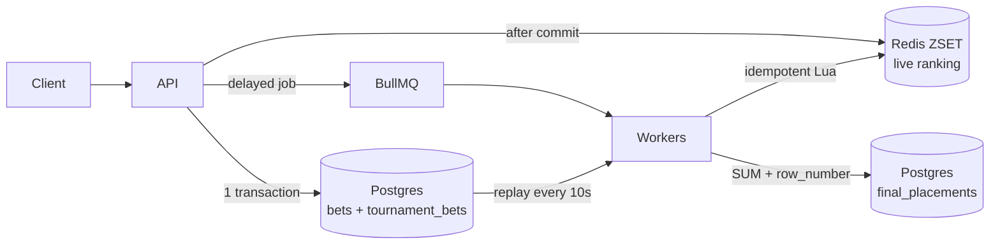

# RealPlay Tournaments

A NestJS/Fastify service with Postgres (Prisma), Redis, and a separate BullMQ workers app. It creates tournaments, ingests bets, serves a live leaderboard from Redis, and writes final placements to Postgres after each tournament ends.

## Run locally

Requires Node.js 20+, pnpm (via Corepack), and Docker.

```bash
corepack enable
cp .env.example .env
pnpm install
docker compose up -d --wait   # Postgres on :5433, Redis 7 on :6380
pnpm prisma:migrate
pnpm dev                      # API on :3000 and the workers app
```

`pnpm docker:up` builds and starts the whole stack instead (`pnpm docker:down` stops it). Swagger UI is at http://localhost:3000/docs.

## Try it

```bash
curl -X POST localhost:3000/tournaments -H 'content-type: application/json' \
  -d '{"name":"Cup","startsAt":"2026-01-01T00:00:00Z","endsAt":"2030-01-01T00:00:00Z"}'
curl -X POST localhost:3000/bet -H 'content-type: application/json' \
  -d '{"externalBetId":"bet_123456","playerId":"player_42","amount":250,"currency":"USD","createdAt":"2026-06-04T12:30:00.000Z"}'
curl 'localhost:3000/tournaments/<tournament-id>/leaderboard?limit=20&offset=0'
```

The tournament ends in 2030 so it is still open. A tournament whose `endsAt` has already passed is finalized as soon as it is created, so a bet sent to it afterwards is stored but not counted (see the grace period under [Tradeoffs](#tradeoffs)).

| Endpoint | Responses |
| --- | --- |
| `POST /tournaments` | `201` · `400` for invalid input (empty name, `endsAt <= startsAt`) · `503` if the snapshot job can't be scheduled; nothing is created |
| `POST /bet` | `201` for a new bet · `200` for a duplicate `externalBetId`, score unchanged · `400` for invalid input. The body lists each tournament the bet counts toward as `counted` or `already_counted`; the list is empty when no open tournament contains `createdAt` |
| `GET /tournaments/:id/leaderboard?limit&offset` | `200` with placements by score descending · `400` for a malformed id or page · `404` for an unknown tournament. `limit` is 1–100 (default 20), `offset` ≥ 0. `source` is `live` (Redis) until the tournament is finalized, then `final` (Postgres) |
| `GET /health` | `200`, or `503` if Postgres or Redis is down |

An endpoint answers `503` when a store it depends on is unreachable (`POST /bet` depends only on Postgres, see step 2 below) and `500` for an unexpected error, both with a `requestId` that also appears in the logs.

## How it works



1. **Ingest.** One transaction inserts the bet with `ON CONFLICT (external_bet_id) DO NOTHING`, so exactly one request stores it, even under concurrent duplicates. That request share-locks every open tournament whose window contains `createdAt` and adds one `tournament_bets` row per tournament. A duplicate inserts nothing; it reads its tournaments back from `tournament_bets`.
2. **Live ranking.** After the commit, a Lua script adds the amount to the player's score in a per-tournament ZSET and records the `externalBetId` in an applied set, so the same bet is never counted twice on the board. Scores are stored negated, so a plain `ZRANGE` returns score descending with ties by `playerId`. If Redis fails at this step the request still succeeds, because the bet is already stored and the replay adds it to the board.
3. **Live board replay.** Every 10 seconds the workers re-apply, through the same Lua script, the ledger rows written since a cursor kept in Redis. This puts a bet on the board even when its Redis update failed, the process crashed after the commit, or Redis lost its data (the cursor is lost with it, so the next run rebuilds every open board).
4. **Scheduling.** `POST /tournaments` adds a delayed BullMQ job for `endsAt` plus a 30-second grace, under a deterministic job id, and only then inserts the row.
5. **Finalization.** The workers lock the tournament `FOR UPDATE`, which waits for any in-flight bet, rank the ledger with `SUM` and `row_number()` into `final_placements`, and set `finalized_at` in the same transaction. A sweep every minute finalizes any tournament whose job was lost or ran out of retries. The replay and the sweep run on in-process timers rather than BullMQ repeatable jobs, so they keep running when Redis loses its data.

## Assumptions

- **Eligibility** is by event time, inclusive: `startsAt <= createdAt <= endsAt`. A bet counts toward every open tournament whose window contains it. Timestamps must be RFC 3339 with an explicit offset (`Z` or `+02:00`), to millisecond precision at most, so eligibility never depends on the server's timezone.
- **Duplicates** are defined by `externalBetId`. The first stored bet wins: a duplicate returns success, adds nothing, and a differing payload is logged as `bet.duplicate_mismatch`.
- **No backfill.** A bet counts toward the tournaments open when it is first stored, so a replay never adds it to a tournament created later.
- **Money** is integer cents, and `amount` must be positive. `currency` is validated (ISO 4217) and stored upper-cased but not converted, because the tournament contract has no currency.
- **Ties** are broken by `playerId` in byte order, identically in Redis and in SQL, so live and final placements match.
- **`POST /bet` is internal**, called by a backend that already authenticated the player; caller authentication belongs at the gateway.

## Tradeoffs

| Decision | Gain | Cost | Upgrade path |
| --- | --- | --- | --- |
| Final placements are computed in SQL from the ledger, never from Redis | Final results are correct whatever happens to Redis | Live and final boards come from two stores | — |
| Redis is updated after the Postgres commit; a ledger replay (idempotent Lua, cursor kept in Redis) repairs missed updates | No dual-write; a bet is never lost or counted twice on the board | The live board can lag ~10s after a failure; Redis needs `maxmemory-policy noeviction` (as in `docker-compose.yml`) | Transactional outbox, or CDC on `tournament_bets` |
| Ingestion `FOR SHARE` / finalization `FOR UPDATE` on the tournament row | A bet in flight at `endsAt` is never lost or counted after the snapshot | Lock churn on hot tournament rows at high write rates | Transaction-scoped advisory locks per tournament |
| A 30s grace period before finalization | Absorbs clock skew and bets that reach the API late | Bets arriving after finalization are stored but not counted | Tune `FINALIZATION_GRACE_MS` |
| `POST /tournaments` has no idempotency key | Matches the requested contract | A client retry after a timeout can create a second tournament | `Idempotency-Key` header with a unique constraint |

## Beyond the brief

The brief asked for a small module. These additions exist because a requirement would otherwise fail in a common case:

| Addition | Why |
| --- | --- |
| Live board replay | Keeps the required live leaderboard correct after a Redis failure, a crash, or Redis data loss |
| Finalization sweep | A lost or exhausted BullMQ job would leave a tournament open and counting forever |
| `503` vs `500` with request ids | Separates an unreachable dependency from a bug, in both the response and the logs |
| Swagger, `/health`, Docker, CI | Makes the service runnable and checkable without reading the code |

## Tests

```bash
docker compose up -d --wait
pnpm test
```

29 integration tests run against real Postgres and Redis (`.env.test`: a separate database and Redis DB).

| Requirement | Spec |
| --- | --- |
| Bet ingestion | `bets.int-spec.ts`, `bet-eligibility.int-spec.ts`: scoring, inclusive window boundaries, overlapping tournaments, validation |
| Duplicate bet handling | `bets.int-spec.ts`: identical duplicate, 20 concurrent duplicates, a duplicate with different fields |
| Leaderboard ordering | `leaderboard.int-spec.ts`, `finalization.int-spec.ts`: score descending, `playerId` tie-break, absolute placements across pages, the same order in SQL |

Beyond the bonus: finalization and the sweep, the real BullMQ job through the workers app, rebuilding the live board after Redis loses its data, and the `503`/`500` split. `pnpm lint`, `pnpm typecheck`, `pnpm build`, and `pnpm prisma:validate` run the static checks.

## Project layout

- `apps/api`, `apps/workers`: thin Nest entry points.
- `libs/tournaments`: the domain. Services hold the flow, every SQL query lives in a `*.repository.ts` next to its feature (enforced by ESLint), and Redis access lives in `leaderboard/live-board`. An existing backend imports `TournamentsHttpModule` in its API and `TournamentsWorkersModule` in its workers.
- `libs/platform`: config, Prisma, Redis, and the BullMQ root connection, which an existing backend already provides.
- `prisma/`: the schema and a single migration with unique constraints, check constraints, and a partial index.
